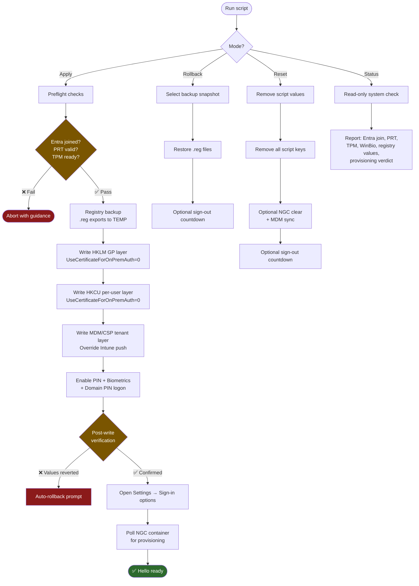

# Enable-WindowsHello

<!-- BADGES:START -->
[](LICENSE) [](https://learn.microsoft.com/en-us/powershell/) [](https://www.microsoft.com/windows) [](https://github.com/5a9awneh/Enable-WindowsHello/commits/main) [](https://github.com/5a9awneh/Enable-WindowsHello) [](https://github.com/5a9awneh/Enable-WindowsHello) [](https://github.com/5a9awneh/Enable-WindowsHello) [](https://github.com/5a9awneh/Enable-WindowsHello)
<!-- BADGES:END -->

Fix Windows Hello (PIN + Fingerprint) provisioning on Entra ID joined devices where Intune's cert-trust WHfB policy blocks enrollment.

## 🚫 The Problem

On Intune-managed, Entra ID joined Windows devices, a certificate-trust Windows Hello for Business (WHfB) policy can silently block Hello provisioning. The device shows no PIN or fingerprint option in **Settings > Sign-in options**, and `dsregcmd /status` never reports `PreReqResult: WillProvision`.

### 🔍 Root Cause

The WHfB provisioning engine reads `UseCertificateForOnPremAuth` from the **per-user HKCU** policy path — not from HKLM. Intune pushes `cert-trust = 1` to HKCU via per-user CSP, which blocks provisioning even when HKLM says `0`. This HKCU override is invisible in Group Policy Editor and undocumented in most troubleshooting guides.

## 💡 The Fix

This script neutralizes the cert-trust gate by writing `UseCertificateForOnPremAuth = 0` to all three policy layers:

| Layer | Registry Path | Why |
|---|---|---|
| **HKLM GP** | `HKLM:\SOFTWARE\Policies\Microsoft\PassportForWork` | ADMX-backed policy (gpedit equivalent) |
| **HKCU Per-User** | `HKCU:\SOFTWARE\Policies\Microsoft\PassportForWork` | **The actual breakthrough** — where the engine reads the value |
| **MDM/CSP Tenant** | `HKLM:\SOFTWARE\Microsoft\Policies\PassportForWork\{TenantGUID}\...` | Overrides Intune-pushed values during CXH provisioning |

It also enables convenience PIN, biometrics, and domain PIN logon, then opens **Settings > Sign-in options** for immediate in-session enrollment — no sign-out required.

## 🎛️ Modes

| Mode | What it does |
|---|---|
| **Apply** | Full fix: preflight checks → registry backup → neutralize cert-trust → enable PIN/biometrics → open Settings for enrollment → verify NGC provisioning |
| **Rollback** | Restore registry from a previous backup (`.reg` files). Supports multiple backup snapshots |
| **Reset** | Remove all script-written values and let Intune re-push defaults. Optionally clears the NGC container and triggers MDM sync |
| **Status** | Read-only system check: Entra join, PRT, TPM, WinBio, all registry values, provisioning verdict |

## 🗺️ How It Works



## �️ Sample Output

**Interactive menu** (when run without `-Mode`):

```
  Enable-WindowsHello -- Windows Hello Provisioning Tool

  1. Apply fix     Neutralize policy + enable Hello
  2. Rollback      Restore from backup (.reg files)
  3. Reset         Remove script changes (no backup)
  4. Status        Show current system & registry state

Select [1-4]:
```

**Status mode** (`-Mode Status`):

```
[INFO] ═══ Enable-WindowsHello -- STATUS CHECK ═══
[OK]   Entra ID Joined : YES
[OK]   AzureAd PRT     : Valid
[OK]   NGC Seeded      : YES
[OK]   TPM 2.0 Ready   : YES
[OK]   WinBio Service  : Running
       PreReqResult    : N/A (only visible during provisioning)

       Registry values:
       HKLM  UseCertificateForOnPremAuth  : 0  [OK]
       HKCU  UseCertificateForOnPremAuth  : 0  [OK - breakthrough]
       MDM   UseCertificateForOnPremAuth  : 0  [OK]
       HKLM  Enabled                      : 1  [OK]
       HKLM  UseCloudTrustForOnPremAuth   : 1  [OK]

[OK]   VERDICT: Hello is provisioned and all registry values are correctly set.
[INFO] ═══ Status check completed ═══
```

## �🚀 Quick Start

### Option 1: Double-click

Run `RUN.cmd` — it auto-elevates to Administrator and shows the interactive menu.

### Option 2: PowerShell

```powershell
# Interactive menu
.\Enable-WindowsHello.ps1

# Direct mode
.\Enable-WindowsHello.ps1 -Mode Status
.\Enable-WindowsHello.ps1 -Mode Apply
.\Enable-WindowsHello.ps1 -Mode Rollback
.\Enable-WindowsHello.ps1 -Mode Reset
```

> **Requires:** Administrator elevation, Windows 10/11, Entra ID joined device.

## 🛡️ Safety Features

- 💾 **Registry backup** before any writes (timestamped `.reg` exports in `%TEMP%`)
- ✅ **Post-write verification** — every `Set-RegValue` is followed by `Test-RegValue`
- ↩️ **Auto-rollback prompt** if verification detects values were reverted by Intune/MDM
- 📝 **Timestamped log** saved to `%TEMP%\EnableHello_*.log`
- ⚡ **No sign-out required** for Apply mode — HKCU override takes effect immediately
- ⏱️ **Rollback** and **Reset** offer a sign-out prompt with a 10-second cancellable countdown

## 🔎 Preflight Checks (Apply Mode)

Before making any changes, the script verifies:

- Entra ID join status (`AzureAdJoined: YES`)
- Primary Refresh Token validity (`AzureAdPrt: YES`)
- TPM 2.0 readiness (via WHfB event log)
- WinBio service status (auto-starts if stopped)
- NGC container state (detects prior provisioning)

## 🧪 Testing

The project includes a [Pester 5](https://pester.dev/) test suite with 56 tests.

```powershell
# Mock tests only (safe anywhere, no admin needed)
Invoke-Pester .\Enable-WindowsHello.Tests.ps1 -ExcludeTag 'Live' -Output Detailed

# Live tests (runs Status mode on real system, requires admin)
Invoke-Pester .\Enable-WindowsHello.Tests.ps1 -Tag 'Live' -Output Detailed

# All tests
Invoke-Pester .\Enable-WindowsHello.Tests.ps1 -Output Detailed
```

Or use `RUN-TESTS.cmd`:

```
RUN-TESTS.cmd          # mock only (default)
RUN-TESTS.cmd live     # live only
RUN-TESTS.cmd all      # both
```

### 📊 Test Coverage

- **47 mock tests**: function unit tests (Write-Log, Set-RegValue, Test-RegValue, Get-TenantGuid, Invoke-Rollback), registry coverage completeness, backup/rollback symmetry, preflight checks, safety features, interactive menu, HKCU cert-trust breakthrough validation
- **9 live tests**: real Status mode execution, system state reporting, registry reads, verdict output, log file creation

## 📁 Files

| File | Purpose |
|---|---|
| `Enable-WindowsHello.ps1` | Main script (4 modes) |
| `Enable-WindowsHello.Tests.ps1` | Pester 5 test suite (56 tests) |
| `RUN.cmd` | Double-click launcher with auto-elevation |
| `RUN-TESTS.cmd` | Test runner (mock / live / all) |
| `README.md` | Project documentation |
| `LICENSE` | MIT license |

## ⚙️ Requirements

- Windows 10/11
- PowerShell 5.1+
- Administrator privileges
- Entra ID (Azure AD) joined device
- Intune-enrolled (for MDM/CSP layer)

## 🖥️ Tested On

- Windows 11, Entra ID joined, Intune enrolled, ST Micro TPM 2.0

## 📄 License

MIT — see [LICENSE](LICENSE). Attribution required.
